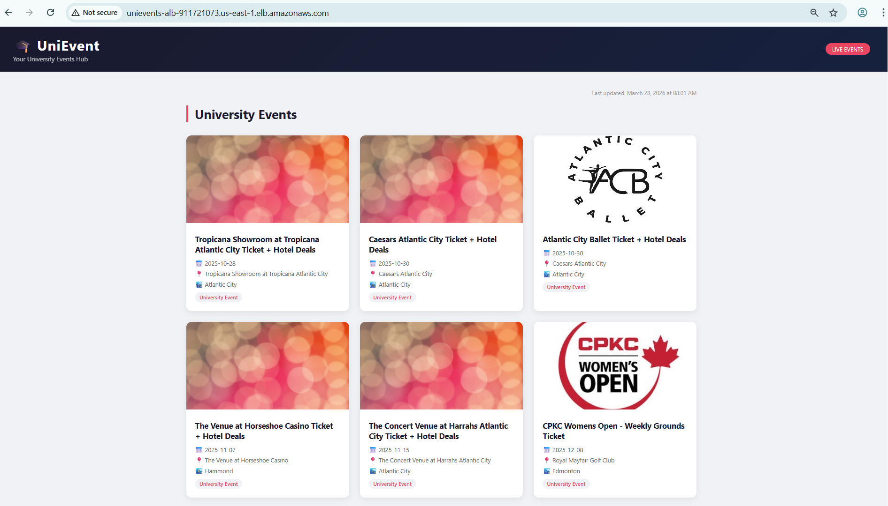
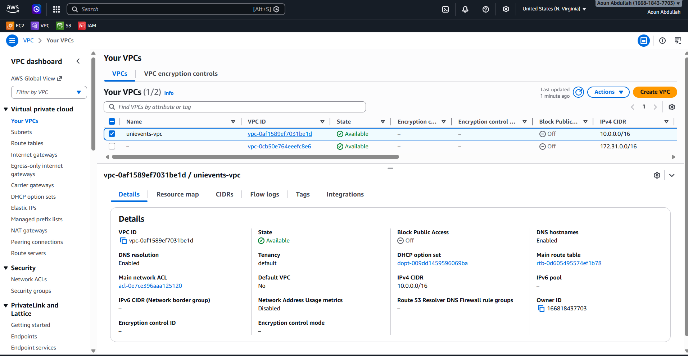
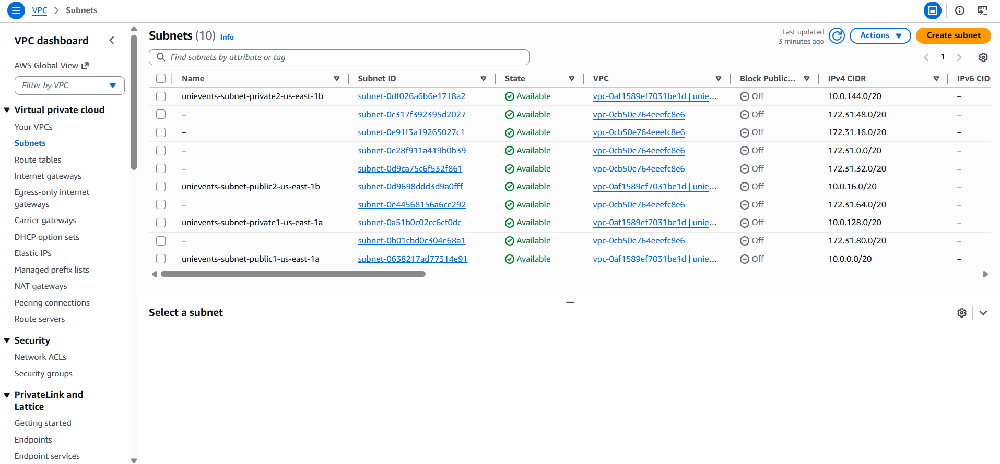
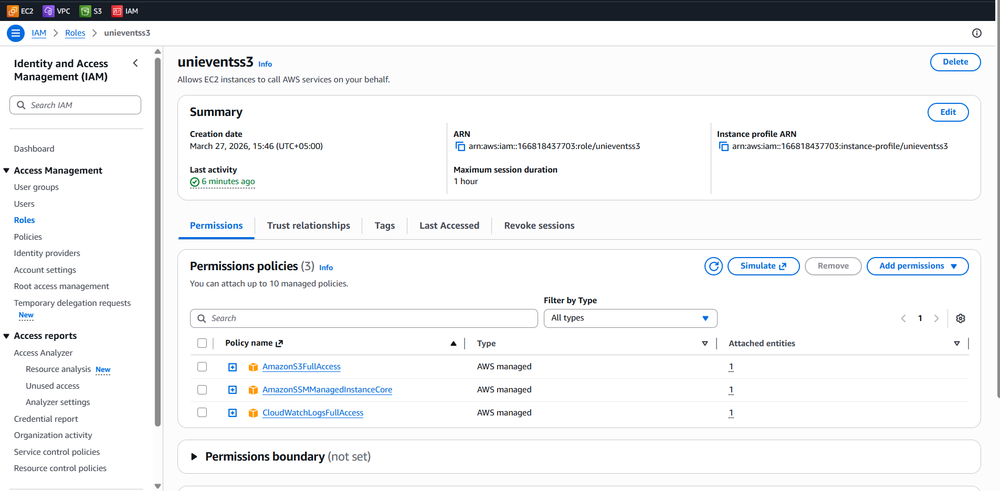
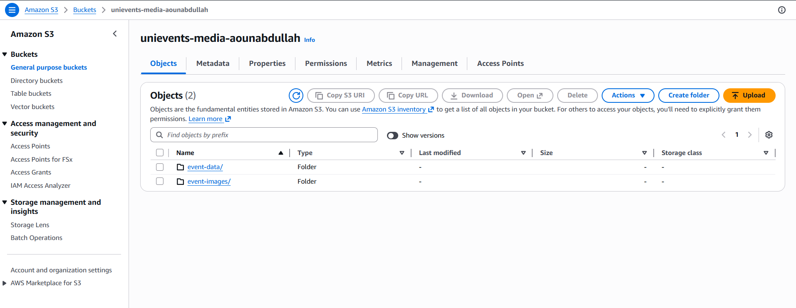
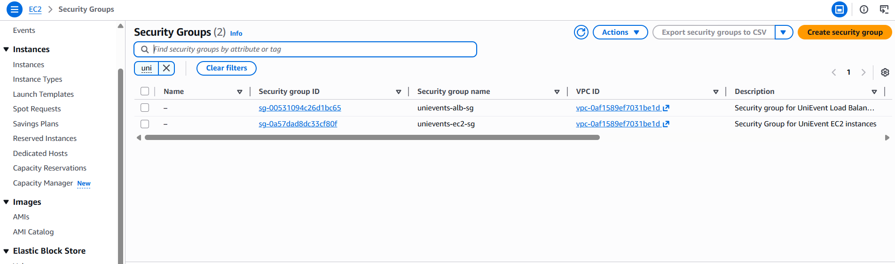
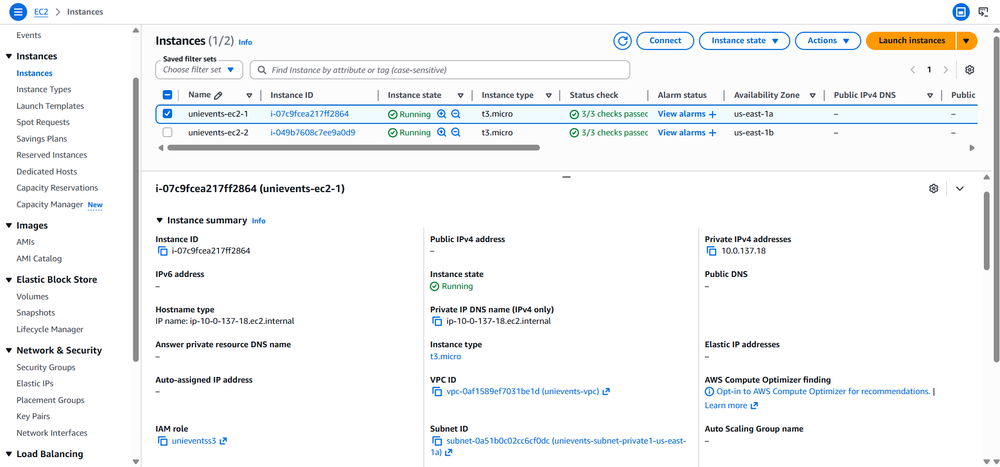
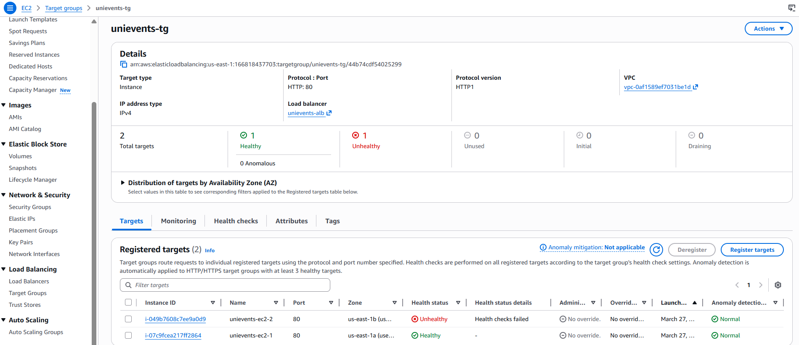

# 🎓 UniEvent — Scalable University Event Management System on AWS


> A fully cloud-hosted, scalable, and fault-tolerant web application built on AWS that automatically fetches and displays university events from the Ticketmaster API. Designed and deployed as part of a Cloud Architecture university assignment.

---

## 📸 Live Website
👉 Click here to visit [http://unievents-alb-911721073.us-east-1.elb.amazonaws.com/]


---

## 📋 Table of Contents

- [Project Overview](#-project-overview)
- [Architecture](#-architecture)
- [AWS Services Used](#-aws-services-used)
- [API Selection & Justification](#-api-selection--justification)
- [Prerequisites](#-prerequisites)
- [Step-by-Step Deployment Guide](#-step-by-step-deployment-guide)
  - [Step 1 — VPC Setup](#step-1--vpc-setup)
  - [Step 2 — IAM Role](#step-2--iam-role)
  - [Step 3 — S3 Bucket](#step-3--s3-bucket)
  - [Step 4 — Security Groups](#step-4--security-groups)
  - [Step 5 — EC2 Instances](#step-5--ec2-instances)
  - [Step 6 — Load Balancer & Target Group](#step-6--load-balancer--target-group)
  - [Step 7 — Application Deployment](#step-7--application-deployment)
- [Security Design](#-security-design)
- [Fault Tolerance](#-fault-tolerance)
- [Repository Structure](#-repository-structure)
- [Screenshots](#-screenshots)

---

## 🌐 Project Overview

**UniEvent** is a centralized university event management platform where students can browse university events fetched automatically from the **Ticketmaster API**. The system is built to be:

- 🔒 **Secure** — EC2 instances in private subnets, no public exposure
- ⚖️ **Scalable** — Application Load Balancer distributing traffic
- 🔄 **Fault Tolerant** — Multiple EC2 instances across Availability Zones
- ☁️ **Cloud Native** — Fully hosted on AWS following best practices

### How The System Works

```
User opens browser
       ↓
Application Load Balancer (public subnet)
       ↓
EC2 Instance 1 or 2 (private subnet)
       ↓
Flask App fetches events from Ticketmaster API
       ↓
Event data & images saved to S3
       ↓
User sees "University Events" on webpage
```

---

## 🏗️ Architecture

### Architecture Breakdown

| Layer | Component | Purpose |
|-------|-----------|---------|
| Public | Application Load Balancer | Single entry point for all traffic |
| Public | NAT Gateway | Allows EC2 to reach external APIs |
| Private | EC2 Instance 1 (us-east-1a) | Runs Flask application |
| Private | EC2 Instance 2 (us-east-1b) | Runs Flask application (redundancy) |
| Storage | S3 Bucket | Stores event data and images |
| Security | IAM Role | Grants EC2 permission to access S3 |
| Network | VPC | Isolated private network |

---

## 🛠️ AWS Services Used

### 1. VPC (Virtual Private Cloud)
Creates an isolated network environment for all resources.
- CIDR Block: `10.0.0.0/16`
- 2 Public Subnets (for ALB and NAT Gateway)
- 2 Private Subnets (for EC2 instances)
- Internet Gateway for public internet access
- NAT Gateway for EC2 outbound API calls

### 2. IAM (Identity & Access Management)
Manages secure access between AWS services.
- EC2 Instance Role: `unievents-ec2-role`
- Permissions: S3 Full Access, CloudWatch Logs, SSM Session Manager
- No hardcoded credentials anywhere in the codebase

### 3. EC2 (Elastic Compute Cloud)
Hosts the Flask web application.
- Instance Type: `t3.micro`
- AMI: Amazon Linux 2023
- Deployed in private subnets (no public IP)
- Two instances across different Availability Zones

### 4. S3 (Simple Storage Service)
Stores event data and images securely.
- Server-side encryption enabled (SSE-S3)
- Versioning enabled
- All public access blocked
- Two folders: `event-data/` and `event-images/`

### 5. Elastic Load Balancing (ALB)
Distributes incoming traffic across EC2 instances.
- Internet-facing Application Load Balancer
- Health checks every 30 seconds
- Automatic failover if an instance goes down

---

## 🎟️ API Selection & Justification

### Selected API: Ticketmaster Discovery API

**Why Ticketmaster?**

| Criteria | Ticketmaster | Eventbrite |
|----------|-------------|------------|
| Free tier | ✅ Yes | ✅ Yes |
| Structured JSON | ✅ Yes | ✅ Yes |
| Event images | ✅ Yes | ⚠️ Limited |
| Authentication | Simple API Key | OAuth required |
| Data richness | ✅ Excellent | ✅ Good |
| Reliability | ✅ Enterprise grade | ✅ Good |

Ticketmaster was selected because:
1. Provides simple API key authentication (no complex OAuth flow)
2. Returns rich structured JSON with all required fields
3. Includes high-quality event images
4. Enterprise-grade reliability and uptime
5. Free tier with generous request limits

### API Endpoint Used
```
GET https://app.ticketmaster.com/discovery/v2/events.json
    ?apikey={API_KEY}
    &keyword=university
    &size=12
    &sort=date,asc
```

### Data Fields Retrieved
- Event name/title
- Event date
- Venue name
- City
- Event images

---

## ✅ Prerequisites

Before deploying this project, ensure you have:

- [ ] AWS Account (Free Tier)
- [ ] Ticketmaster Developer Account + API Key
- [ ] Python 3.9+
- [ ] AWS CLI configured (optional)
- [ ] GitHub account

---

## 📖 Step-by-Step Deployment Guide

### Step 1 — VPC Setup

**Goal:** Create an isolated network for all our resources.

1. Go to AWS Console → VPC → Create VPC
2. Select **"VPC and More"**
3. Configure:

| Setting | Value |
|---------|-------|
| Name | `unievents` |
| IPv4 CIDR | `10.0.0.0/16` |
| Availability Zones | 2 |
| Public Subnets | 2 |
| Private Subnets | 2 |
| NAT Gateway | In 1 AZ |
| IPv6 | None |

4. Click **Create VPC**

**Result:** VPC with 4 subnets, Internet Gateway, NAT Gateway, and route tables automatically created.




---

### Step 2 — IAM Role

**Goal:** Give EC2 instances secure access to S3 and other AWS services.

1. Go to IAM → Roles → Create Role
2. Trusted entity: **AWS Service → EC2**
3. Add these 3 policies:
   - `AmazonS3FullAccess`
   - `CloudWatchLogsFullAccess`
   - `AmazonSSMManagedInstanceCore`
4. Name: `unievents-ec2-role`
5. Click **Create Role**

**Why these permissions?**
- S3 Access → Store event data and images
- CloudWatch → Monitor application logs
- SSM → Securely connect to EC2 without SSH keys



---

### Step 3 — S3 Bucket

**Goal:** Create secure storage for event data and images.

1. Go to S3 → Create Bucket
2. Configure:

| Setting | Value |
|---------|-------|
| Bucket name | `unievents-media-{yourname}` |
| Region | `us-east-1` |
| Block all public access | ✅ Enabled |
| Versioning | ✅ Enabled |
| Encryption | SSE-S3 |

3. Create two folders inside:
   - `event-data/` — Stores JSON event data
   - `event-images/` — Stores event poster images



---

### Step 4 — Security Groups

**Goal:** Control network traffic to and from our resources.

#### ALB Security Group (`unievents-alb-sg`)

| Direction | Protocol | Port | Source |
|-----------|----------|------|--------|
| Inbound | HTTP | 80 | `0.0.0.0/0` |
| Outbound | All | All | All |

#### EC2 Security Group (`unievents-ec2-sg`)

| Direction | Protocol | Port | Source |
|-----------|----------|------|--------|
| Inbound | HTTP | 80 | `unievents-alb-sg` |
| Outbound | HTTPS | 443 | `0.0.0.0/0` |

**Security Design:**
- EC2 instances only accept traffic FROM the Load Balancer
- EC2 instances can only make outbound HTTPS calls (for Ticketmaster API)
- Nobody can directly reach EC2 instances from the internet



---

### Step 5 — EC2 Instances

**Goal:** Launch two web servers in private subnets across different AZs.

Launch **2 instances** with these settings:

| Setting | Instance 1 | Instance 2 |
|---------|-----------|-----------|
| Name | `unievents-ec2-1` | `unievents-ec2-2` |
| AMI | Amazon Linux 2023 | Amazon Linux 2023 |
| Type | `t3.micro` | `t3.micro` |
| Subnet | Private (us-east-1a) | Private (us-east-1b) |
| Public IP | Disabled | Disabled |
| Security Group | `unievents-ec2-sg` | `unievents-ec2-sg` |
| IAM Role | `unievents-ec2-role` | `unievents-ec2-role` |



---

### Step 6 — Load Balancer & Target Group

**Goal:** Distribute traffic across EC2 instances and enable fault tolerance.

#### Create Target Group
1. Go to EC2 → Target Groups → Create
2. Configure:

| Setting | Value |
|---------|-------|
| Name | `unievents-tg` |
| Target type | Instances |
| Protocol | HTTP |
| Port | 80 |
| VPC | `unievents-vpc` |
| Health check path | `/health` |

3. Register both EC2 instances

#### Create Application Load Balancer
1. Go to EC2 → Load Balancers → Create ALB
2. Configure:

| Setting | Value |
|---------|-------|
| Name | `unievents-alb` |
| Scheme | Internet-facing |
| VPC | `unievents-vpc` |
| Subnets | Both public subnets |
| Security Group | `unievents-alb-sg` |
| Listener | HTTP:80 → `unievents-tg` |




---

### Step 7 — Application Deployment

**Goal:** Deploy the Flask application on both EC2 instances.

#### Connect to EC2
1. Go to EC2 → Instances → Select instance
2. Click **Connect** → **Session Manager** → **Connect**

#### Install Dependencies
```bash
sudo su
yum update -y
yum install python3 python3-pip -y
pip3 install flask boto3 requests
```

#### Deploy Application
```bash
nano app.py
# Paste the application code
# Replace YOUR_TICKETMASTER_API_KEY and YOUR_S3_BUCKET_NAME
# Ctrl+X → Y → Enter to save
```

#### Run Application (Background)
```bash
nohup sudo python3 app.py > app.log 2>&1 &
```

#### Verify Running
```bash
ps aux | grep python3
```

Repeat on both EC2 instances.

---

## 🔐 Security Design

| Security Layer | Implementation |
|----------------|---------------|
| Network isolation | EC2 in private subnets |
| No public IP on EC2 | Disabled on launch |
| Least privilege IAM | Only required permissions |
| S3 private | All public access blocked |
| Encrypted storage | SSE-S3 encryption |
| No hardcoded credentials | IAM role used instead |
| Single entry point | Only ALB is public facing |

> **Note:** In a production environment, HTTPS would be enabled using AWS Certificate Manager (ACM) attached to the Application Load Balancer. This was omitted as it falls outside the current assignment scope but is acknowledged as a production best practice.

---

## 🔄 Fault Tolerance

The system continues operating even if one EC2 instance fails:

```
Normal Operation:          One Instance Fails:
                          
User → ALB               User → ALB
        ↓                        ↓
   EC2-1 ✅             EC2-1 ❌ (detected by health check)
   EC2-2 ✅             EC2-2 ✅ (all traffic routed here)
```

**How it works:**
1. ALB performs health checks every 30 seconds
2. If an instance fails, ALB automatically stops routing traffic to it
3. All traffic goes to the healthy instance
4. Zero downtime for users

---

## 📁 Repository Structure

```
unievents-aws/
│
├── infrastructure/
│     ├── vpc.py          — VPC CDK stack (generated by AWS Console)
│     ├── iam.py          — IAM Role CDK stack
│     ├── s3.py           — S3 Bucket CDK stack
│     ├── ec2.py          — EC2 Instance CDK stack
│     └── alb.py          — Load Balancer CDK stack
│
├── application/
│     └── app.py          — Flask web application
│
├── screenshots/
│     ├── vpc-dashboard.png
│     ├── subnets.png
│     ├── iam-role.png
│     ├── s3-bucket.png
│     ├── security-groups.png
│     ├── ec2-instances.png
│     ├── alb.png
│     ├── target-group.png
│     └── live-website.png
│
└── README.md
```

---

## 📸 Screenshots

### VPC Dashboard


### EC2 Instances Running


### Load Balancer Active


### Target Group Healthy


### Live UniEvent Website


---

## 👨‍💻 Author

Built with ❤️ using AWS Cloud Services

---

*This project was built as part of a Cloud Architecture university assignment demonstrating scalable, secure, and fault-tolerant AWS infrastructure design.*
